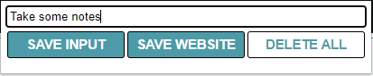
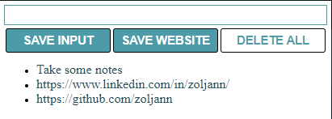

# Chrome-extension

My first project.I chose to work on something simple, just like chrome extension, fun thing to add in your portfolio!If you ever used bookmarks, this will be very useful for you.

  

### Saving website

On click save website you're saving current website that is opened in browser.

  

### Taking notes
You can also take some short notes, or some daily reminders.

  
   
  

